# ikPharma - Complete High-Level Technical Architecture

## System Overview

ikPharma is a modular monolith pharmacy management system with a Flutter frontend and Python FastAPI backend, leveraging Firebase/GCP infrastructure for scalability and managed services. The architecture prioritizes clean module boundaries to enable future microservices extraction if scale demands.

---

## Features (MVP)

### 1. Authentication & User Management

Anonymous trial users can instantly start using the app, then seamlessly upgrade to paid accounts without data loss. Business admins manage user accounts, roles, and subscription preferences through a comprehensive RBAC system. The system supports three distinct tiers: Trial (anonymous evaluation), Paid (self-service SMBs), and Enterprise (sales-led large chains with custom requirements).

#### Tech Involved
- Firebase Authentication (Anonymous, Google, Facebook, Email/Password)
- PostgreSQL via Firebase Data Connect (user profiles, roles, permissions, business tier metadata)
- Paddle.com API (subscription management for Trial and Paid tiers)
- FastAPI (authentication middleware, JWT token management, tier-based feature gating)
- Custom sales/contract management system for Enterprise tier

#### Main Requirements
- **Anonymous Firebase Auth accounts** must be convertible to authenticated accounts with full data migration
- **Role-based access control (RBAC)** enforced at API level with granular permissions (view, create, edit, delete, approve)
- **Three-tier subscription model**:
  - **Trial**: Anonymous users, 4-week evaluation, 500 items/transactions limit, full feature access
  - **Paid**: Self-service via Paddle.com, PKR 60K upfront + PKR 400-500/month, 3 base users, scalable add-ons
  - **Enterprise**: Sales-led, custom pricing, unlimited users/roles, dedicated support, custom SLA, white-glove onboarding
- **Tier-specific provisioning**:
  - Trial/Paid: Automated via Paddle webhooks
  - Enterprise: Manual approval workflow with sales team involvement
- **Feature flag system** based on business tier (e.g., API access, custom integrations only for Enterprise)
- **Subscription state management**: Trial period tracking, payment status, user/role bundle limits, contract dates for Enterprise
- **JWT token refresh strategy** with secure token rotation and tier claims embedded in token
- **Audit logging** of all authentication events, role changes, and tier transitions
- **Integration with Paddle.com webhooks** for subscription lifecycle events (payment success, cancellation, upgrades) for Trial and Paid tiers
- **Enterprise-specific features**: Account manager assignment, custom SLA configuration, dedicated support channel setup

---

### 2. Business Onboarding & Configuration

New users complete a guided setup wizard to configure business profile, tax settings, compliance rules, and location hierarchy. The system adapts to different country-specific regulatory requirements.

#### Tech Involved
- PostgreSQL (business profiles, tax configurations, compliance rules, location hierarchies)
- FastAPI (configuration validation, hierarchy setup logic)
- Cloud Storage (regulatory document templates, business logos)

#### Main Requirements
- Multi-tenancy: Complete data isolation between businesses at database level
- Location hierarchy modeling: Support for 3-level hierarchies (Head Office → Regional → Stores) with parent-child relationships
- Country-agnostic compliance framework: Configurable rules engine for different regulatory regimes
- Tax configuration: Support for multiple tax types (GST, Sales Tax, VAT) with product-category-specific rates
- Hierarchical replenishment flow rules: Define which locations can request from which parent locations
- Validation logic: Prevent circular hierarchies, enforce business rule constraints
- Default role creation: Auto-create base roles (Admin, Manager, Cashier) during business setup

---

### 3. Inventory Management

Comprehensive product master data management with batch tracking, expiry monitoring, multi-location visibility, cycle counts, and inter-location transfers. Includes intelligent reorder suggestions based on ML-driven seasonal pattern analysis.

#### Tech Involved
- PostgreSQL (products, batches, inventory levels, bin locations, transfer orders, cycle counts)
- FastAPI (inventory business logic, FEFO enforcement, transfer workflows)
- Cloud Storage (product images, barcode/QR code generation)
- Python ML libraries: scikit-learn, pandas (seasonal pattern detection, reorder intelligence)
- Cloud Functions (scheduled jobs for expiry alerts, reorder suggestion generation)
- Firebase Cloud Messaging (push notifications for low stock, expiry warnings)

#### Main Requirements
- **Batch & Expiry Tracking**: Every inventory item linked to batch with expiry date; FEFO (First Expiry, First Out) enforcement at POS
- **Multi-location Inventory**: Real-time visibility of stock levels across all locations with drill-down capability
- **Bin/Rack Management**: Hierarchical warehouse layout (Zone → Aisle → Rack → Bin) for efficient picking
- **Cycle Counting**: Mobile-optimized counting interface with barcode scanning, variance investigation workflow
- **Inter-location Transfers**: Multi-stage workflow (Initiated → Approved → Packed → In Transit → Received → Verified) with scan verification at origin and destination
- **Expiry Monitoring**: Configurable multi-level alerts per product (e.g., 90/60/30 days), dashboard showing expiring stock sorted by value at risk
- **Reorder Intelligence**: 
  - ML model trains on historical sales data (daily/weekly aggregates) to learn seasonal patterns
  - Triggered on-demand (not real-time) via scheduled Cloud Function
  - Combines minimum stock levels + sales velocity + learned seasonality
  - Outputs: product, recommended quantity, urgency level, confidence score
  - One-click conversion to purchase requisition
- **Barcode Generation**: Auto-generate QR codes for products without manufacturer barcodes
- **CRUD Operations**: Products, Batches, Bin Locations, Transfer Orders, Cycle Count Sheets, Inventory Adjustments

---

### 4. Supplier Management & Procurement

End-to-end procurement cycle from requisition to payment, with 3-way matching, supplier performance tracking, and approval workflows.

#### Tech Involved
- PostgreSQL (suppliers, purchase requisitions, purchase orders, goods receipts, invoices, payments)
- FastAPI (procurement workflow engine, 3-way matching logic, approval routing)
- Cloud Storage (supplier documents, contracts, PO PDFs)
- Firebase Cloud Messaging (approval request notifications)

#### Main Requirements
- **Supplier Master Data**: Contact details, payment terms, credit limits, tier classification, performance metrics
- **Purchase Requisition Workflow**: 
  - Staff creates requisition → approval routing based on business rules (amount thresholds, user role)
  - Status tracking: Pending → Approved → Rejected → Converted to PO
- **Purchase Order Management**:
  - Auto-populate from approved requisitions or manual creation
  - Send PO to supplier (email, WhatsApp, PDF download)
  - Track status: Sent → Acknowledged → Partially Received → Fully Received → Closed
- **Goods Receipt**: 
  - Receive full or partial quantities against PO
  - Barcode scanning for verification
  - Capture batch numbers and expiry dates
  - Bin location assignment during putaway
- **3-Way Matching**:
  - Compare PO (ordered qty/price) vs Goods Receipt (received qty) vs Invoice (billed amount)
  - Handle edge cases: partial delivery with full invoice, price variances, missing items
  - Flag discrepancies for resolution workflow
  - Approve invoice for payment only after successful match
- **Payment Processing**:
  - Link payments to one or more invoices
  - Update accounts payable
  - Track outstanding invoices by due date
  - Generate automated payment reminders
- **Supplier Performance Tracking**:
  - Quality metrics: defect rate, return rate
  - Delivery metrics: on-time delivery %, partial delivery frequency
  - Pricing metrics: average price per product, price trends
  - Composite reliability score for supplier ranking
- **CRUD Operations**: Suppliers, Requisitions, Purchase Orders, Goods Receipts, Invoices, Payments

---

### 5. Point of Sale (POS)

Mobile-first POS with camera-based barcode scanning, WhatsApp receipt delivery, multi-counter operations, customer tiering, prescription management, and returns handling.

#### Tech Involved
- PostgreSQL (customers, sales transactions, line items, payments, prescriptions, returns)
- FastAPI (POS business logic, pricing engine, FEFO batch selection, transaction processing)
- Flutter (camera barcode scanning, WhatsApp integration)
- Cloud Storage (prescription images, receipt PDFs)
- Redis (session management for multi-counter operations, cart state)

#### Main Requirements
- **Multi-Device POS**: Simultaneous operations on mobile/tablet/desktop with independent sessions per counter
- **Barcode Scanning**: Camera-based scanning with fallback to manual entry or dedicated USB scanners
- **Product Search**: Instant search by name, generic name, salt composition with autocomplete
- **Customer Tiering**: 
  - 6 tiers: Walk-in, Platinum, Diamond, Gold, Silver, Bronze
  - Automatic price calculation based on customer tier
  - Display available credit limit for credit customers
- **Pricing Engine**: 
  - Customer-specific pricing rules (percentage discount or fixed price per tier)
  - Discount authorization rules based on user role
  - Support for split payments (cash + card, multiple payment methods)
- **FEFO Enforcement**: 
  - Automatically select batch with nearest expiry date when adding item to cart
  - Display expiry warning if batch expires within threshold (configurable per product)
- **Prescription Management**:
  - Capture prescription details: doctor name, license, date, patient info
  - Attach prescription image via camera
  - Block sale of controlled substances without valid prescription
  - Link prescription to transaction for regulatory reporting
- **Receipt Generation**:
  - Multiple delivery methods: WhatsApp (with pre-filled message), thermal printer, email, no receipt
  - Receipt includes: transaction details, batch expiry dates, prescription reference
- **Returns & Exchanges**:
  - Look up original transaction
  - Select items to return with reason code (expired, damaged, wrong item, customer request)
  - Refund methods: cash, card, store credit
  - Automatic inventory restock if item condition permits
  - Update financial records (revenue reversal, inventory adjustment)
- **Multi-Counter Coordination**:
  - Redis-based session management for cart state
  - Real-time inventory reservation to prevent overselling
  - Consolidated end-of-day reporting across all counters
- **CRUD Operations**: Customers, Sales Transactions, Line Items, Payments, Returns, Prescriptions

---

### 6. Financial Accounting

Integrated accounting with General Ledger, Accounts Payable/Receivable, profit & loss statements, tax reporting, and bank reconciliation. All financial data exportable to Excel for external analysis.

#### Tech Involved
- PostgreSQL (chart of accounts, journal entries, invoices, payments, tax records)
- FastAPI (accounting logic, financial calculations, report generation)
- Python libraries: pandas, openpyxl (Excel export generation)
- Cloud Storage (generated financial reports, export files)

#### Main Requirements
- **General Ledger**: 
  - Configurable chart of accounts
  - Double-entry bookkeeping enforced at application level
  - Journal entry creation from all transactional modules (sales, purchases, payments)
  - Trial balance generation with date range filtering
- **Accounts Receivable**:
  - Customer invoice tracking
  - Payment receipt recording linked to invoices
  - Aging reports (current, 30, 60, 90+ days overdue)
  - Automated payment reminders via email/SMS
- **Accounts Payable**:
  - Supplier invoice tracking
  - Payment recording linked to invoices
  - Aging reports showing amounts owed by due date
  - Payment schedule forecasting
- **Financial Statements**:
  - Profit & Loss: Revenue, COGS, Operating Expenses, Net Profit (configurable date ranges)
  - Balance Sheet: Assets, Liabilities, Equity (point-in-time snapshot)
  - Cash Flow Statement: Operating, Investing, Financing activities
- **Tax Reporting**:
  - Configurable tax rates per product category
  - Tax collected (output tax) and tax paid (input tax) tracking
  - Monthly/quarterly/annual tax summaries
  - Support for Pakistan GST/Sales Tax with extensibility for other countries
  - Withholding tax calculations
- **Bank Reconciliation**:
  - Import bank statements (CSV/Excel)
  - Match statement transactions to recorded transactions
  - Flag unmatched items for investigation
  - Automatic reconciliation suggestions based on amount/date matching
- **Excel Export**:
  - All financial reports exportable with configurable date ranges
  - Scheduled exports (daily, weekly, monthly)
  - Custom report templates
- **CRUD Operations**: Chart of Accounts, Journal Entries, Customer Invoices, Supplier Invoices, Payments, Tax Records

---

### 7. Human Resources & Payroll

Employee attendance tracking with GPS clock-in/out, shift scheduling, leave management, payroll calculation with sales commission integration, and performance tracking.

#### Tech Involved
- PostgreSQL (employees, attendance records, shifts, leave balances, payroll, performance reviews)
- FastAPI (attendance logic, payroll calculations, commission rules engine)
- Flutter (GPS location capture for clock-in/out)
- Python libraries: pandas (payroll calculations, attendance aggregation)
- Firebase Cloud Messaging (shift reminders, leave approval notifications)

#### Main Requirements
- **Attendance Tracking**:
  - Mobile clock-in/clock-out with GPS location stamp (geofencing validation)
  - Shift scheduling: Define shifts, assign employees, handle shift swaps
  - Attendance dashboard: Present, Absent, Late, On Leave status
  - Overtime tracking with approval workflow
- **Leave Management**:
  - Leave request submission via mobile
  - Approval routing to manager
  - Leave balance tracking (annual, sick, casual)
  - Leave calendar view per employee and team-wide
- **Payroll Calculation**:
  - Support for multiple pay structures: Fixed salary, hourly wages, commission-only, hybrid
  - Automatic integration of attendance data (hours worked, overtime)
  - Automatic integration of sales commission data from POS transactions
  - Deductions: Taxes, advances, loans, provident fund
  - Payslip generation (PDF) with detailed breakdown
  - Export payroll summary to Excel for accounting integration
- **Commission Rules Engine**:
  - Configurable commission structures: Flat rate, tiered, product-specific
  - Commission calculation based on sales performance (revenue, units sold, profit margin)
  - Commission caps and floors
  - Multi-level commission for team performance
- **Performance Tracking**:
  - Sales metrics per employee (revenue, units, average transaction value)
  - Attendance and punctuality metrics
  - Manual performance reviews and ratings
  - Training records and certifications
- **CRUD Operations**: Employees, Attendance Records, Shifts, Leave Requests, Payroll Runs, Commission Rules, Performance Reviews

---

### 8. Internal Messaging & Team Inbox

Secure tenant-scoped messaging system enabling team communication with conversations, drafts, read receipts, and folder organization. Supports both direct messages and group conversations for workflow coordination.

#### Tech Involved
- PostgreSQL (messages, conversations, participants, folders, read receipts)
- FastAPI (message routing, real-time delivery, search)
- Redis (real-time message queuing, online presence tracking, unread counts cache)
- Firebase Cloud Messaging (push notifications for new messages)
- WebSockets (real-time message delivery, typing indicators)
- PostgreSQL Full-Text Search (message search functionality)
- Cloud Storage (message attachments)

#### Main Requirements
- **Tenant Isolation**: All messages strictly scoped to business_id, no cross-tenant leakage
- **Conversation Types**:
  - Direct messages: 1-on-1 conversations between users
  - Group conversations: Multiple participants (e.g., "Warehouse Team", "Store Managers")
  - System notifications: Auto-generated messages (e.g., "Approval needed for PO #123")
- **Message Features**:
  - Rich text formatting (bold, italic, lists, links)
  - File attachments (images, PDFs, documents via Cloud Storage, max 25MB per file)
  - Message threading/replies
  - Edit message (within 15 minutes, shows "edited" indicator)
  - Delete message (soft delete, shows "Message deleted")
  - React to messages (emoji reactions)
  - @mentions to notify specific users
  - Priority flags (normal, important, urgent)
- **Folder Organization**:
  - System folders: Inbox, Sent, Drafts, Archived, Trash
  - Custom folders: User-created (e.g., "Supplier Communications", "HR Matters")
  - Smart filters: Unread, Flagged, From specific users
- **Read Status & Receipts**:
  - Read/Unread tracking per message per recipient
  - "Seen by" indicator showing who read the message and when
  - Typing indicators ("User is typing...")
  - Delivery status (sent, delivered, read)
- **Draft Management**:
  - Auto-save drafts every 30 seconds
  - Multiple concurrent drafts per user
  - Draft expiration (delete after 30 days of inactivity)
- **Real-time Features**:
  - Live message delivery via WebSockets
  - Online/offline presence indicators
  - Push notifications for new messages (mobile)
  - Desktop notifications (web)
  - Unread badge counts updated in real-time
- **Search & Filter**:
  - Full-text search across message content
  - Filter by sender, date range, conversation, folder, read status
  - Search within attachments (PDF text extraction)
- **Integration with Other Features**:
  - Send messages from POS (e.g., "Low stock alert to manager")
  - Link messages to transactions, POs, requisitions
  - Approval workflows trigger messages
  - Automated messages for system events (expiry alerts, payment reminders)
- **Privacy & Security**:
  - Messages encrypted in transit (TLS 1.3)
  - Message retention policies (configurable: 30/60/90 days or forever)
  - Admin controls: Export messages for compliance
  - Cannot message users outside tenant boundary
- **Performance Requirements**:
  - Message delivery: < 1 second for real-time
  - Search results: < 500ms
  - Pagination: 50 messages per page
- **CRUD Operations**: Messages, Conversations, Participants, Folders, Drafts, Read Receipts, Reactions, Attachments

---

### 9. Reporting & Analytics

Strategic business intelligence with product performance, supplier analysis, customer profitability, location metrics, financial planning, operational efficiency, and regulatory compliance reports. Custom report builder with scheduled delivery.

#### Tech Involved
- PostgreSQL (all transactional data)
- FastAPI (report generation engine, data aggregation)
- Python libraries: pandas, numpy (data analysis), matplotlib, plotly (chart generation)
- Firebase ML (anomaly detection for unusual patterns)
- Cloud Storage (generated reports, scheduled exports)
- Cloud Functions (scheduled report generation)

#### Main Requirements
- **Product Performance Reports**:
  - Best sellers by revenue, quantity, profit margin
  - Slow-moving products (low sales velocity)
  - Expired stock losses by product and supplier
  - Stock aging analysis (inventory older than 30/60/90 days)
  - Product profitability analysis (gross margin per product)
  - AI-driven recommendations: Products to discontinue, products to promote
- **Supplier Performance Reports**:
  - Purchase volume per supplier
  - Supplier reliability score (quality + delivery + pricing composite)
  - Price comparison across suppliers for same products
  - Defect rate and return rate per supplier
  - On-time delivery percentage
  - Recommendations: Best value suppliers per product category
- **Customer Profitability Reports**:
  - Revenue and profit margin per customer category
  - Customer lifetime value analysis
  - Credit customers: Payment behavior, overdue aging
  - Top customers by revenue and profit
  - Recommendations: Most profitable customer categories
- **Location Performance Reports**:
  - Sales, profit, inventory value per location
  - Underperforming locations (below average metrics)
  - Transfer frequency and efficiency
  - Staff productivity per location
  - Recommendations: Locations needing attention, expansion opportunities
- **Financial Planning Reports**:
  - Cash flow forecast (30/60/90 days) using ML trend analysis
  - Accounts receivable and payable aging
  - Working capital analysis
  - Break-even analysis
  - Budget vs actual variance
- **Operational Efficiency Reports**:
  - Inventory turnover ratio
  - Days sales outstanding (DSO)
  - Purchase order cycle time
  - Stock availability rate
  - Expiry loss rate
- **Regulatory Compliance Reports**:
  - Controlled substances dispensing log
  - Prescription tracking
  - Batch recall reports
  - Adverse event reporting
  - Pharmacovigilance summary
  - Tax compliance (GST/Sales Tax)
- **Custom Report Builder**:
  - Drag-and-drop interface for dimensions, metrics, filters, groupings
  - Save custom report templates
  - Schedule automated delivery (email, dashboard)
  - Export formats: Excel, CSV, PDF
  - Interactive dashboards with drill-down capability
- **Visualization**:
  - Sales trends over time (daily, weekly, monthly, yearly)
  - Seasonal pattern visualization (learned by ML)
  - Category/location/supplier performance comparison
  - Anomaly detection alerts (sudden stock drops, unusual sales spikes)

---

### 10. Import/Export & Data Management

Bulk data import from Excel/CSV with validation, scheduled exports, data security with encryption and audit logging, and disaster recovery capabilities.

#### Tech Involved
- PostgreSQL (all data storage)
- FastAPI (import/export logic, validation)
- Python libraries: pandas, openpyxl (Excel/CSV processing)
- Cloud Storage (uploaded files, generated exports, backups)
- Cloud Functions (scheduled exports, backup jobs)

#### Main Requirements
- **Data Import**:
  - Support for Excel/CSV uploads (products, customers, suppliers, inventory opening balances)
  - Client-side and server-side validation
  - Duplicate detection and merge strategies
  - Dry-run mode: Preview import results without committing
  - Error reporting with specific row/column references
  - Background job processing for large imports (with progress tracking)
- **Data Export**:
  - Export transactions, inventory snapshots, customer/supplier lists, financial statements
  - Configurable filters (date range, location, user, status)
  - Multiple formats: Excel, CSV, PDF
  - Scheduled exports (daily, weekly, monthly) triggered by Cloud Functions
  - Download links delivered via email
- **Data Security**:
  - TLS 1.3 for data in transit
  - AES-256 encryption for data at rest (PostgreSQL encryption)
  - Role-based data access control enforced at API level
  - Two-factor authentication (2FA) for admin accounts using Firebase Auth
  - Audit logging: All data modifications logged with user, timestamp, IP address, before/after values
- **Backup & Disaster Recovery**:
  - Automated daily incremental backups via Firebase/GCP
  - Weekly full backups retained for 90 days
  - Point-in-time restore capability
  - Backup encryption before storage
  - Regular restore testing (quarterly)
- **GDPR Compliance**:
  - Data deletion requests (right to be forgotten)
  - Data portability (export all user data)
  - Consent management for data processing
  - Data retention policies

---

### 11. Offline Mode & Synchronization

Essential POS and inventory lookup functionality available offline, with intelligent conflict resolution and background sync when connectivity resumes.

#### Tech Involved
- Flutter (local database: SQLite or Drift)
- FastAPI (sync endpoints, conflict resolution logic)
- PostgreSQL (master data source)
- Redis (sync queue management)
- Cloud Functions (background sync coordination)

#### Main Requirements
- **Offline Capabilities**:
  - POS: Complete transaction workflow (add to cart, apply discounts, generate receipt) available offline
  - Inventory Lookup: Read-only access to product catalog, stock levels, batch information
  - Messaging: Read cached messages offline, compose drafts (queued for sending when online)
  - Data stored in local SQLite database on device
  - Offline transaction marked with "pending-sync" status
- **Optimistic Concurrency Control**:
  - Version stamps on inventory records (last_updated_at timestamp, version number)
  - Offline sale reserves inventory locally with "pending-sync" status
  - When online transaction occurs for same item, version check prevents conflict
- **Conflict Resolution Strategy**:
  - **Online transactions take precedence** (authoritative source of truth)
  - Offline transactions that would cause negative inventory are:
    - Queued in "conflict_queue" table
    - Flagged for manual resolution by warehouse manager
    - Notification sent via Firebase Cloud Messaging
  - Conflict resolution UI: Shows both transactions side-by-side, allows manager to:
    - Accept offline transaction (adjust inventory to negative, trigger reorder)
    - Reject offline transaction (refund customer, void sale)
    - Partial fulfillment (adjust quantity, process partial refund)
- **Synchronization Process**:
  - Background sync triggered when connectivity restored (detected by Flutter connectivity plugin)
  - Sync priority: Authentication status → Critical data (products, prices) → Transactions → Messages → Reports
  - Incremental sync: Only changes since last successful sync
  - Sync status tracking: Per-record sync state (pending, syncing, synced, conflict)
  - User notification: "Syncing..." banner with progress indicator
  - Retry logic: Exponential backoff for failed sync attempts
- **Data Consistency Safeguards**:
  - Transactions include full snapshot of relevant data (product price, customer tier, tax rate) at time of sale
  - Avoids retroactive price changes affecting past transactions
  - Inventory adjustments logged with reason code and timestamp

---

## System Diagram

```mermaid
graph TB
    subgraph "Client Layer"
        Flutter[Flutter App<br/>Mobile/Tablet/Desktop/Web]
    end

    subgraph "Firebase Services"
        FirebaseAuth[Firebase Authentication]
        AppCheck[Firebase App Check<br/>Bot/Abuse Prevention]
        FCM[Firebase Cloud Messaging<br/>Push Notifications]
        CloudStorage[Google Cloud Storage<br/>Images, Documents, Reports]
        Analytics[Firebase Analytics]
        FirebaseML[Firebase ML<br/>OCR, Image Recognition]
        CloudFunctions[Cloud Functions<br/>Scheduled Jobs, Webhooks]
    end

    subgraph "API Gateway Layer"
        LoadBalancer[Cloud Load Balancer]
        RateLimiter[Rate Limiter<br/>Redis-backed]
    end

    subgraph "Application Layer - FastAPI Backend on Cloud Run"
        AuthMiddleware[Auth Middleware<br/>JWT Validation]
        
        subgraph "Core Modules - Modular Monolith"
            AuthModule[Authentication & User Management]
            InventoryModule[Inventory Management]
            ProcurementModule[Procurement & Supplier Mgmt]
            POSModule[Point of Sale]
            AccountingModule[Financial Accounting]
            HRModule[HR & Payroll]
            MessagingModule[Internal Messaging]
            ReportingModule[Reporting & Analytics]
            ConfigModule[Business Configuration]
        end
        
        MLEngine[ML Engine<br/>Reorder Intelligence<br/>scikit-learn, pandas]
        WebSocketHandler[WebSocket Handler<br/>Real-time Messaging]
    end

    subgraph "Data Layer"
        PostgreSQL[(PostgreSQL<br/>via Firebase Data Connect)]
        Redis[(Redis<br/>Sessions, Cache, Rate Limiting,<br/>Presence, Unread Counts)]
    end

    subgraph "External Services"
        Paddle[Paddle.com<br/>Subscription Management]
        WhatsApp[WhatsApp API<br/>Receipt Delivery]
        EmailService[Email Service<br/>Reports, Notifications]
    end

    Flutter -->|HTTPS/TLS 1.3| AppCheck
    Flutter <-->|WebSocket| WebSocketHandler
    AppCheck --> LoadBalancer
    LoadBalancer --> RateLimiter
    RateLimiter --> AuthMiddleware
    
    Flutter <-->|Anonymous/Social/Email Auth| FirebaseAuth
    Flutter -->|Upload Images/Attachments| CloudStorage
    Flutter <-->|Push Notifications| FCM
    Flutter -->|Events Tracking| Analytics
    
    AuthMiddleware --> AuthModule
    AuthMiddleware --> InventoryModule
    AuthMiddleware --> ProcurementModule
    AuthMiddleware --> POSModule
    AuthMiddleware --> AccountingModule
    AuthMiddleware --> HRModule
    AuthMiddleware --> MessagingModule
    AuthMiddleware --> ReportingModule
    AuthMiddleware --> ConfigModule
    
    WebSocketHandler --> MessagingModule
    
    AuthModule --> PostgreSQL
    InventoryModule --> PostgreSQL
    ProcurementModule --> PostgreSQL
    POSModule --> PostgreSQL
    AccountingModule --> PostgreSQL
    HRModule --> PostgreSQL
    MessagingModule --> PostgreSQL
    ReportingModule --> PostgreSQL
    ConfigModule --> PostgreSQL
    
    InventoryModule --> MLEngine
    ReportingModule --> MLEngine
    MLEngine --> PostgreSQL
    
    POSModule --> Redis
    RateLimiter --> Redis
    MessagingModule --> Redis
    WebSocketHandler --> Redis
    
    CloudFunctions -->|Scheduled Jobs| InventoryModule
    CloudFunctions -->|Expiry Alerts| FCM
    CloudFunctions -->|Report Generation| ReportingModule
    CloudFunctions -->|Paddle Webhooks| AuthModule
    CloudFunctions -->|Message Notifications| MessagingModule
    
    AuthModule -->|Subscription Events| Paddle
    POSModule -->|Send Receipts| WhatsApp
    MessagingModule -->|Message Notifications| EmailService
    ReportingModule -->|Report Delivery| EmailService
    InventoryModule -->|Product Images| CloudStorage
    POSModule -->|Prescription Images| CloudStorage
    MessagingModule -->|Message Attachments| CloudStorage
    ReportingModule -->|Generated Reports| CloudStorage
    
    InventoryModule -.->|Optional: Future Feature| FirebaseML
    
    style Flutter fill:#4285F4,stroke:#333,stroke-width:2px,color:#fff
    style PostgreSQL fill:#336791,stroke:#333,stroke-width:2px,color:#fff
    style Redis fill:#DC382D,stroke:#333,stroke-width:2px,color:#fff
    style FirebaseAuth fill:#FFCA28,stroke:#333,stroke-width:2px
    style CloudStorage fill:#FFCA28,stroke:#333,stroke-width:2px
    style FCM fill:#FFCA28,stroke:#333,stroke-width:2px
    style Analytics fill:#FFCA28,stroke:#333,stroke-width:2px
    style FirebaseML fill:#FFCA28,stroke:#333,stroke-width:2px
    style CloudFunctions fill:#FFCA28,stroke:#333,stroke-width:2px
    style MessagingModule fill:#34A853,stroke:#333,stroke-width:2px,color:#fff
    style WebSocketHandler fill:#34A853,stroke:#333,stroke-width:2px,color:#fff
```



---

## Detailed Architecture Patterns

### 1. Modular Monolith Structure

```
ikpharma-backend/
├── app/
│   ├── core/
│   │   ├── auth/          # JWT, permissions, Firebase Auth integration
│   │   ├── database/      # PostgreSQL connection, migrations
│   │   ├── cache/         # Redis client
│   │   ├── storage/       # Cloud Storage client
│   │   ├── websocket/     # WebSocket manager
│   │   └── exceptions/    # Global exception handlers
│   ├── modules/
│   │   ├── auth/          # Authentication & User Management
│   │   │   ├── models.py
│   │   │   ├── schemas.py
│   │   │   ├── service.py
│   │   │   ├── repository.py
│   │   │   └── routes.py
│   │   ├── inventory/     # Inventory Management
│   │   │   ├── models.py
│   │   │   ├── schemas.py
│   │   │   ├── service.py
│   │   │   ├── repository.py
│   │   │   ├── ml_engine.py  # Reorder intelligence
│   │   │   └── routes.py
│   │   ├── procurement/   # Procurement & Supplier Management
│   │   ├── pos/           # Point of Sale
│   │   ├── accounting/    # Financial Accounting
│   │   ├── hr/            # HR & Payroll
│   │   ├── messaging/     # Internal Messaging & Team Inbox
│   │   │   ├── models.py
│   │   │   ├── schemas.py
│   │   │   ├── service.py
│   │   │   ├── repository.py
│   │   │   ├── websocket.py  # WebSocket handlers
│   │   │   └── routes.py
│   │   ├── reporting/     # Reporting & Analytics
│   │   └── config/        # Business Configuration
│   ├── shared/
│   │   ├── utils/         # Common utilities
│   │   ├── enums/         # Shared enumerations
│   │   └── constants/     # Application constants
│   └── main.py            # FastAPI application entry point
├── alembic/               # Database migrations
├── tests/
└── requirements.txt
```

**Key Principles:**
- **Clean Boundaries**: Each module has its own models, schemas, service layer, repository layer, and routes
- **Dependency Injection**: Modules depend on abstractions (interfaces), not concrete implementations
- **Single Responsibility**: Each module handles one business domain
- **Future-Proof**: Can extract any module as a microservice by:
  - Adding a separate database connection
  - Exposing internal service layer as API endpoints
  - Minimal code changes due to clean separation

---

### 2. Data Model Highlights

**Multi-Tenancy Strategy:**
- Every table includes `business_id` as foreign key
- Row-level security (RLS) policies in PostgreSQL enforce data isolation
- Application-level tenant context set on every database session

**Business Tier Management:**
```sql
-- Core business table with tier support
CREATE TYPE business_tier AS ENUM ('TRIAL', 'PAID', 'ENTERPRISE');

CREATE TABLE businesses (
    id UUID PRIMARY KEY DEFAULT gen_random_uuid(),
    name VARCHAR(255) NOT NULL,
    tier business_tier NOT NULL DEFAULT 'TRIAL',
    
    -- Trial-specific
    trial_start_date TIMESTAMP,
    trial_end_date TIMESTAMP,
    
    -- Paid tier (Paddle.com integration)
    paddle_subscription_id VARCHAR(255),
    paddle_customer_id VARCHAR(255),
    monthly_charge DECIMAL(10,2),
    user_bundles INTEGER DEFAULT 0,
    premium_roles_count INTEGER DEFAULT 0,
    free_months_remaining INTEGER DEFAULT 0,
    
    -- Enterprise tier (Sales-led)
    contract_start_date DATE,
    contract_end_date DATE,
    account_manager_id UUID REFERENCES users(id),
    sla_level VARCHAR(50),
    custom_limits JSONB,
    custom_features JSONB,
    
    created_at TIMESTAMP DEFAULT NOW(),
    updated_at TIMESTAMP DEFAULT NOW(),
    is_active BOOLEAN DEFAULT TRUE
);
```

**Key Relationships:**
- **Inventory**: `Product` → `Batch` → `InventoryLevel` (by location) → `BinLocation`
- **Procurement**: `PurchaseRequisition` → `PurchaseOrder` → `GoodsReceipt` → `Invoice` → `Payment`
- **Sales**: `Customer` → `SalesTransaction` → `LineItem` (linked to Batch for FEFO)
- **Accounting**: All modules emit `JournalEntry` records for GL integration
- **Messaging**: `Conversation` → `Message` → `MessageRecipient` (read status per user) → `Attachment`

**Messaging Schema:**
```sql
-- Conversations (threads)
CREATE TABLE conversations (
    id UUID PRIMARY KEY DEFAULT gen_random_uuid(),
    business_id UUID NOT NULL REFERENCES businesses(id),
    conversation_type VARCHAR(20) CHECK (conversation_type IN ('DIRECT', 'GROUP', 'SYSTEM')),
    title VARCHAR(255),
    created_by UUID REFERENCES users(id),
    created_at TIMESTAMP DEFAULT NOW(),
    updated_at TIMESTAMP DEFAULT NOW(),
    last_message_at TIMESTAMP,
    is_archived BOOLEAN DEFAULT FALSE
);

CREATE INDEX idx_conversations_business ON conversations(business_id);
CREATE INDEX idx_conversations_updated ON conversations(business_id, last_message_at DESC);

-- Conversation participants
CREATE TABLE conversation_participants (
    id UUID PRIMARY KEY DEFAULT gen_random_uuid(),
    conversation_id UUID NOT NULL REFERENCES conversations(id) ON DELETE CASCADE,
    user_id UUID NOT NULL REFERENCES users(id),
    joined_at TIMESTAMP DEFAULT NOW(),
    left_at TIMESTAMP,
    role VARCHAR(20) DEFAULT 'MEMBER',
    is_muted BOOLEAN DEFAULT FALSE,
    UNIQUE(conversation_id, user_id)
);

-- Messages
CREATE TABLE messages (
    id UUID PRIMARY KEY DEFAULT gen_random_uuid(),
    business_id UUID NOT NULL REFERENCES businesses(id),
    conversation_id UUID NOT NULL REFERENCES conversations(id) ON DELETE CASCADE,
    sender_id UUID REFERENCES users(id),
    parent_message_id UUID REFERENCES messages(id),
    content TEXT NOT NULL,
    content_type VARCHAR(20) DEFAULT 'TEXT',
    priority VARCHAR(20) DEFAULT 'NORMAL',
    
    is_draft BOOLEAN DEFAULT FALSE,
    is_edited BOOLEAN DEFAULT FALSE,
    edited_at TIMESTAMP,
    is_deleted BOOLEAN DEFAULT FALSE,
    deleted_at TIMESTAMP,
    
    linked_entity_type VARCHAR(50),
    linked_entity_id UUID,
    
    created_at TIMESTAMP DEFAULT NOW(),
    sent_at TIMESTAMP,
    
    search_vector tsvector GENERATED ALWAYS AS (to_tsvector('english', content)) STORED
);

CREATE INDEX idx_messages_conversation ON messages(conversation_id, created_at DESC);
CREATE INDEX idx_messages_search ON messages USING gin(search_vector);

-- Message recipients (read tracking)
CREATE TABLE message_recipients (
    id UUID PRIMARY KEY DEFAULT gen_random_uuid(),
    message_id UUID NOT NULL REFERENCES messages(id) ON DELETE CASCADE,
    user_id UUID NOT NULL REFERENCES users(id),
    delivered_at TIMESTAMP,
    read_at TIMESTAMP,
    folder VARCHAR(50) DEFAULT 'INBOX',
    is_starred BOOLEAN DEFAULT FALSE,
    UNIQUE(message_id, user_id)
);

CREATE INDEX idx_recipients_unread ON message_recipients(user_id) WHERE read_at IS NULL;

-- Message attachments
CREATE TABLE message_attachments (
    id UUID PRIMARY KEY DEFAULT gen_random_uuid(),
    message_id UUID NOT NULL REFERENCES messages(id) ON DELETE CASCADE,
    file_name VARCHAR(255) NOT NULL,
    file_size BIGINT NOT NULL,
    file_type VARCHAR(100),
    storage_path VARCHAR(500) NOT NULL,
    uploaded_at TIMESTAMP DEFAULT NOW()
);

-- Message reactions
CREATE TABLE message_reactions (
    id UUID PRIMARY KEY DEFAULT gen_random_uuid(),
    message_id UUID NOT NULL REFERENCES messages(id) ON DELETE CASCADE,
    user_id UUID NOT NULL REFERENCES users(id),
    emoji VARCHAR(10) NOT NULL,
    created_at TIMESTAMP DEFAULT NOW(),
    UNIQUE(message_id, user_id, emoji)
);

-- User folders
CREATE TABLE user_folders (
    id UUID PRIMARY KEY DEFAULT gen_random_uuid(),
    user_id UUID NOT NULL REFERENCES users(id),
    name VARCHAR(100) NOT NULL,
    color VARCHAR(7),
    sort_order INTEGER DEFAULT 0,
    created_at TIMESTAMP DEFAULT NOW(),
    UNIQUE(user_id, name)
);
```

---

### 3. API Design Patterns

**RESTful Endpoints:**
```
# Authentication & Subscription
POST   /api/v1/auth/anonymous-signup
POST   /api/v1/auth/upgrade-account
POST   /api/v1/auth/enterprise-inquiry
GET    /api/v1/subscription/status
POST   /api/v1/subscription/upgrade-tier

# Inventory
GET    /api/v1/inventory/products
POST   /api/v1/inventory/products
GET    /api/v1/inventory/products/{id}
PATCH  /api/v1/inventory/products/{id}
DELETE /api/v1/inventory/products/{id}
POST   /api/v1/inventory/products/{id}/batches
GET    /api/v1/inventory/reorder-suggestions

# POS
POST   /api/v1/pos/transactions
POST   /api/v1/pos/transactions/{id}/returns

# Reporting
GET    /api/v1/reports/product-performance
POST   /api/v1/reports/custom

# Enterprise
GET    /api/v1/enterprise/features
POST   /api/v1/enterprise/custom-integration

# Messaging
GET    /api/v1/messages/inbox
GET    /api/v1/messages/sent
GET    /api/v1/messages/drafts
GET    /api/v1/messages/folders/{folder}
POST   /api/v1/messages
POST   /api/v1/messages/drafts
PATCH  /api/v1/messages/{id}
DELETE /api/v1/messages/{id}
POST   /api/v1/messages/{id}/read
POST   /api/v1/messages/{id}/unread
POST   /api/v1/messages/{id}/star
POST   /api/v1/messages/{id}/move
POST   /api/v1/messages/{id}/reactions
DELETE /api/v1/messages/{id}/reactions/{emoji}
GET    /api/v1/messages/search
GET    /api/v1/messages/unread-count
GET    /api/v1/conversations
GET    /api/v1/conversations/{id}
POST   /api/v1/conversations
PATCH  /api/v1/conversations/{id}
DELETE /api/v1/conversations/{id}
GET    /api/v1/conversations/{id}/messages
POST   /api/v1/conversations/{id}/participants
DELETE /api/v1/conversations/{id}/participants/{user_id}
GET    /api/v1/folders
POST   /api/v1/folders
PATCH  /api/v1/folders/{id}
DELETE /api/v1/folders/{id}
GET    /api/v1/users/online

# WebSocket
WS     /ws/messages
```

**Tier-Based Rate Limiting:**
- Firebase App Check validates all requests at perimeter (blocks bots)
- FastAPI middleware enforces tier-specific rate limits:
  - **Trial**: 500 requests/minute per business
  - **Paid**: 100 requests/minute per user (reads), 30/minute (writes)
  - **Enterprise**: Custom limits (default: 1000 requests/minute per business)
  - Redis-backed sliding window counter
- Cloud Run concurrency limit: 80 concurrent requests per instance

**Feature Gating Middleware:**
```python
from functools import wraps

def require_tier(allowed_tiers: List[str]):
    def decorator(func):
        @wraps(func)
        async def wrapper(*args, **kwargs):
            business = get_current_business()
            if business.tier not in allowed_tiers:
                raise HTTPException(
                    status_code=403,
                    detail={
                        "code": "TIER_REQUIRED",
                        "message": f"This feature requires {' or '.join(allowed_tiers)} tier"
                    }
                )
            return await func(*args, **kwargs)
        return wrapper
    return decorator
```

---

### 4. State Management (Flutter/Riverpod)

**Provider Structure:**
```dart
// Authentication State
final authStateProvider = StreamProvider<User?>(...);
final currentBusinessProvider = FutureProvider<Business>(...);

// Inventory State
final productsProvider = FutureProvider.family<List<Product>, ProductFilters>(...);
final productDetailProvider = FutureProvider.family<Product, String>(...);
final lowStockAlertsProvider = StreamProvider<List<Product>>(...);

// POS State
final cartProvider = StateNotifierProvider<CartNotifier, Cart>(...);
final selectedCustomerProvider = StateProvider<Customer?>(...);

// Messaging State
final conversationsProvider = StreamProvider<List<Conversation>>(...);
final conversationMessagesProvider = FutureProvider.family<List<Message>, String>(...);
final unreadCountProvider = StreamProvider<Map<String, int>>(...);
final messageDraftProvider = StateNotifierProvider.family<DraftNotifier, MessageDraft?, String>(...);
final onlineUsersProvider = StreamProvider<List<User>>(...);
final typingIndicatorProvider = StreamProvider.family<Set<String>, String>(...);
final inboxMessagesProvider = FutureProvider.family<List<Message>, InboxFilters>(...);

// Offline Sync State
final syncStatusProvider = StateNotifierProvider<SyncNotifier, SyncStatus>(...);
final pendingTransactionsProvider = FutureProvider<List<Transaction>>(...);
final conflictQueueProvider = StreamProvider<List<Conflict>>(...);
```

---

### 5. Security Architecture

**Authentication Flow:**
```
1. User opens app → Firebase Auth checks for existing session
2. If new user (anonymous): 
   - Create anonymous Firebase user
   - Backend creates trial business (tier=TRIAL, trial_end_date=+4 weeks)
3. User interacts with app → Firebase Auth provides ID token
4. Flutter app exchanges ID token for JWT from backend
5. JWT includes: user_id, business_id, business_tier, roles, permissions, tier_expires_at
6. All API requests include JWT in Authorization header
7. FastAPI middleware validates JWT and extracts claims
8. Tier-based feature gating and rate limiting applied
9. Request context populated with user identity, permissions, and tier info
10. Business logic enforces authorization rules and tier limits
```

**Tier-Specific Authentication:**
```python
# JWT payload includes tier information
{
    "user_id": "uuid",
    "business_id": "uuid",
    "business_tier": "PAID",
    "roles": ["ADMIN", "WAREHOUSE_MANAGER"],
    "permissions": ["inventory.create", "inventory.edit", ...],
    "tier_features": ["ml_reorder", "multi_location", "advanced_reports"],
    "tier_expires_at": "2025-12-31T23:59:59Z",
    "exp": 1642348800
}
```

**Messaging Security:**
```python
# Tenant isolation check
@app.post("/api/v1/messages")
async def send_message(data: MessageCreate, user: User):
    # Validate recipients are in same tenant
    recipients = get_users_by_ids(data.recipient_ids)
    for recipient in recipients:
        if recipient.business_id != user.business_id:
            raise HTTPException(403, "Cannot message users outside your organization")
    
    # Proceed with message creation...
```

---

### 6. Performance Optimization Strategies

**Database Query Optimization:**
- Indexes on frequently queried columns:
  - `products`: `business_id, name, barcode, category_id`
  - `inventory_levels`: `business_id, product_id, location_id`
  - `messages`: `business_id, conversation_id, created_at`
  - `message_recipients`: `user_id, read_at, folder`
- Full-text search index on messages
- Composite indexes for multi-column queries

**Caching Strategy (Redis):**
- **L1 Cache**: In-memory cache in FastAPI (LRU, 15-min TTL)
  - Product catalog
  - User permissions
- **L2 Cache**: Redis (distributed cache)
  - Session data (cart state, message drafts)
  - Rate limiting counters
  - Online presence tracking
  - Unread message counts
  - Frequently accessed reports
- **Cache Invalidation**:
  - Write-through for critical data
  - TTL-based expiration for non-critical
  - Event-driven for real-time features

**WebSocket Optimization:**
- Connection pooling per business_id
- Heartbeat/ping-pong every 30 seconds
- Automatic reconnection with exponential backoff
- Message batching for bulk delivery
- Redis Pub/Sub for horizontal scaling across Cloud Run instances

---

### 7. ML/AI Integration Architecture

**Reorder Intelligence Pipeline:**
```python
# Scheduled Cloud Function triggers daily at 2 AM
def generate_reorder_suggestions(business_id: str):
    # 1. Extract historical sales data
    sales_data = fetch_sales_history(business_id, date_range="last_2_years")
    
    # 2. Feature engineering
    features = engineer_features(sales_data)
    
    # 3. Train/update SARIMAX model per product category
    for category in product_categories:
        model = train_seasonal_model(
            data=features[features.category == category],
            algorithm="SARIMAX"
        )
        store_model(business_id, category, model)
    
    # 4. Generate predictions and reorder suggestions
    suggestions = []
    for product in active_products:
        forecast = predict_demand(product.id, horizon_days=30)
        current_stock = get_current_stock(business_id, product.id)
        
        if should_reorder(current_stock, forecast):
            suggestions.append({
                "product_id": product.id,
                "recommended_quantity": calculate_reorder_qty(forecast),
                "urgency": calculate_urgency(),
                "confidence": model.confidence_score
            })
    
    # 5. Store and notify
    save_reorder_suggestions(business_id, suggestions)
    notify_procurement_team(business_id, suggestions)
```

---

### 8. Internal Messaging System Implementation

**WebSocket Connection Handler:**
```python
class MessageWebSocketHandler:
    active_connections: Dict[str, Set[WebSocket]] = {}
    
    async def connect(self, websocket: WebSocket, user: User):
        await websocket.accept()
        
        business_id = str(user.business_id)
        if business_id not in self.active_connections:
            self.active_connections[business_id] = set()
        self.active_connections[business_id].add(websocket)
        
        # Update online presence in Redis
        await redis.sadd(f"online_users:{business_id}", str(user.id))
        await redis.expire(f"online_users:{business_id}", 300)
        
        # Notify others
        await self.broadcast_presence_update(business_id, user.id, "online")
    
    async def disconnect(self, websocket: WebSocket, user: User):
        business_id = str(user.business_id)
        self.active_connections[business_id].discard(websocket)
        await redis.srem(f"online_users:{business_id}", str(user.id))
        await self.broadcast_presence_update(business_id, user.id, "offline")
    
    async def send_message(self, business_id: str, message: Message):
        if business_id in self.active_connections:
            recipients = get_message_recipients(message.id)
            for websocket in self.active_connections[business_id]:
                user_id = get_user_from_websocket(websocket)
                if user_id in recipients:
                    await websocket.send_json({
                        "type": "new_message",
                        "message": message.to_dict()
                    })

@app.websocket("/ws/messages")
async def websocket_endpoint(websocket: WebSocket, token: str):
    user = verify_jwt(token)
    ws_handler = MessageWebSocketHandler()
    
    try:
        await ws_handler.connect(websocket, user)
        while True:
            data = await websocket.receive_json()
            if data["type"] == "typing":
                await ws_handler.broadcast_typing_indicator(data)
            elif data["type"] == "ping":
                await websocket.send_json({"type": "pong"})
    except WebSocketDisconnect:
        await ws_handler.disconnect(websocket, user)
```

**Message Sending Flow:**
```python
@app.post("/api/v1/messages")
async def send_message(data: MessageCreate, user: User):
    # Validate tenant isolation
    recipients = get_users_by_ids(data.recipient_ids)
    for recipient in recipients:
        if recipient.business_id != user.business_id:
            raise HTTPException(403, "Cannot message outside organization")
    
    # Get or create conversation
    conversation = get_or_create_conversation(
        business_id=user.business_id,
        type="DIRECT" if len(recipients) == 1 else "GROUP",
        participants=[user.id] + data.recipient_ids
    )
    
    # Create message
    message = Message(
        business_id=user.business_id,
        conversation_id=conversation.id,
        sender_id=user.id,
        content=data.content,
        priority=data.priority or "NORMAL",
        sent_at=datetime.now()
    )
    db.add(message)
    db.flush()
    
    # Handle attachments
    for attachment_file in data.attachments:
        storage_path = upload_to_cloud_storage(attachment_file)
        attachment = MessageAttachment(
            message_id=message.id,
            file_name=attachment_file.filename,
            file_size=attachment_file.size,
            storage_path=storage_path
        )
        db.add(attachment)
    
    # Create recipient records
    for recipient in recipients:
        db.add(MessageRecipient(
            message_id=message.id,
            user_id=recipient.id,
            folder="INBOX"
        ))
    
    # Sender's copy in Sent folder
    db.add(MessageRecipient(
        message_id=message.id,
        user_id=user.id,
        folder="SENT",
        read_at=datetime.now()
    ))
    
    conversation.last_message_at = datetime.now()
    db.commit()
    
    # Real-time delivery
    await ws_handler.send_message(str(user.business_id), message)
    
    # Push notifications for offline users
    for recipient in recipients:
        if not is_user_online(recipient.id):
            send_push_notification(
                recipient.id,
                title=f"New message from {user.name}",
                body=truncate(message.content, 100)
            )
    
    # Update unread counts
    for recipient in recipients:
        await redis.incr(f"unread_count:{recipient.id}:INBOX")
    
    # Handle @mentions
    mentions = extract_mentions(message.content)
    for mention in mentions:
        mentioned_user = get_user_by_username(mention, user.business_id)
        if mentioned_user:
            create_notification(mentioned_user.id, "MENTION")
    
    return {"message_id": message.id, "conversation_id": conversation.id}
```

**Draft Auto-Save (Flutter):**
```dart
class MessageComposer extends ConsumerStatefulWidget {
  @override
  _MessageComposerState createState() => _MessageComposerState();
}

class _MessageComposerState extends ConsumerState<MessageComposer> {
  Timer? _debounceTimer;
  final _contentController = TextEditingController();
  
  @override
  void initState() {
    super.initState();
    
    // Auto-save draft every 30 seconds
    _contentController.addListener(() {
      _debounceTimer?.cancel();
      _debounceTimer = Timer(Duration(seconds: 30), _saveDraft);
    });
  }
  
  Future<void> _saveDraft() async {
    if (_contentController.text.isEmpty) return;
    await ref.read(messagingServiceProvider).saveDraft(
      conversationId: widget.conversationId,
      content: _contentController.text,
    );
  }
  
  @override
  void dispose() {
    _debounceTimer?.cancel();
    _saveDraft();
    _contentController.dispose();
    super.dispose();
  }
}
```

**Message Search:**
```python
@app.get("/api/v1/messages/search")
async def search_messages(
    query: str,
    folder: Optional[str] = None,
    sender_id: Optional[UUID] = None,
    date_from: Optional[datetime] = None,
    date_to: Optional[datetime] = None,
    user: User = Depends(get_current_user)
):
    search_query = db.query(Message).join(MessageRecipient).filter(
        Message.business_id == user.business_id,
        MessageRecipient.user_id == user.id,
        Message.is_deleted == False
    )
    
    # Full-text search
    if query:
        search_query = search_query.filter(
            Message.search_vector.op('@@')(func.to_tsquery('english', query))
        )
    
    # Additional filters
    if folder:
        search_query = search_query.filter(MessageRecipient.folder == folder)
    if sender_id:
        search_query = search_query.filter(Message.sender_id == sender_id)
    if date_from:
        search_query = search_query.filter(Message.created_at >= date_from)
    if date_to:
        search_query = search_query.filter(Message.created_at <= date_to)
    
    messages = search_query.order_by(Message.created_at.desc()).limit(50).all()
    
    return {"messages": [msg.to_dict() for msg in messages]}
```

---

### 9. Scalability & High Availability

**Horizontal Scaling (Cloud Run):**
- Auto-scaling: Min 1, Max 100 instances
- Target CPU: 70%, Concurrency: 80 requests/instance
- WebSocket sticky sessions via session affinity

**Database Scaling:**
- Start: db-custom-4-16384 (4 vCPUs, 16GB RAM)
- Connection pooling via PgBouncer
- Read replicas for reports/analytics
- Partitioning by business_id for large tables

**Redis Scaling:**
- Single instance → Redis Cluster when > 50GB
- Pub/Sub for WebSocket message broadcasting across instances

**Disaster Recovery:**
- RTO: 1 hour, RPO: 5 minutes
- Daily PostgreSQL backups (90-day retention)
- Cross-region Cloud Storage replication

---

### 10. Monitoring & Observability

**Key Metrics:**
- Backend: Request rate, response time (p50/p95/p99), error rate
- Database: Query time, connection pool usage
- WebSocket: Active connections, message delivery latency
- Business: Active users, messages sent, transactions processed

**Alerting:**
- Critical: API error > 5%, DB connections exhausted, WebSocket disconnect rate > 10%
- Warning: Response time p95 > 1s, cache hit < 70%

---

### 11. Deployment Pipeline & CI/CD

**GitHub Actions Workflow:**
```yaml
# Backend
- Build Docker image
- Run tests (unit, integration)
- Deploy to Cloud Run (staging)
- Smoke tests
- Deploy to production (gradual rollout)
- Monitor error rates
- Rollback if errors > 5%

# Frontend
- Build Flutter apps (web, mobile)
- Deploy web to Firebase Hosting
- Upload mobile to Play/App Store (beta)
- Promote after approval
```

---

## Feature Interaction Matrix

| Interaction | Description | Implementation |
|------------|-------------|----------------|
| **Inventory ↔ POS** | POS checks availability, FEFO batch selection | POS calls `check_availability()`, `reserve_batch()` |
| **Inventory ↔ Procurement** | Goods receipt updates inventory | Procurement emits `goods_received` event |
| **POS ↔ Accounting** | Sales create journal entries | POS emits `sale_completed` event |
| **Procurement ↔ Accounting** | POs and payments create entries | Emits `invoice_approved`, `payment_made` |
| **HR ↔ POS** | Track employee sales performance | Transactions include `employee_id` |
| **Messaging ↔ All Modules** | System messages for events | Modules emit events → Messaging creates system messages |
| **Inventory ↔ Messaging** | Low stock alerts | Inventory alerts trigger messages to managers |
| **Procurement ↔ Messaging** | Approval requests | Requisitions/POs trigger approval messages |
| **All Modules ↔ Auth** | Validate permissions and tier limits | Call `has_permission()`, `check_tier_limit()` |
| **Subscription ↔ All Modules** | Enforce tier limits | Centralized `TierLimitService` |

---

## Tier Comparison Matrix

| Feature | Trial | Paid | Enterprise |
|---------|-------|------|------------|
| **Duration** | 4 weeks | Ongoing | Annual contract |
| **Cost** | Free | PKR 60K + 400-500/mo | Custom pricing |
| **Inventory Items** | 500 | Unlimited | Unlimited |
| **Transactions/Day** | 500 | Unlimited | Unlimited |
| **Users** | 3 | 3 + bundles | Unlimited |
| **POS** | ✓ | ✓ | ✓ |
| **Inventory** | ✓ | ✓ | ✓ |
| **Procurement** | ✓ | ✓ | ✓ |
| **Accounting** | ✓ | ✓ | ✓ |
| **HR & Payroll** | ✓ | ✓ | ✓ |
| **Team Messaging** | ✓ (Limited) | ✓ | ✓ |
| **ML Reorder** | ✗ | ✓ | ✓ |
| **API Access** | ✗ | ✗ | ✓ |
| **Custom Integrations** | ✗ | ✗ | ✓ |
| **Dedicated Support** | ✗ | ✗ | ✓ |
| **SLA** | Best effort | 99% | 99.9% |

---

## Security Checklist

- [x] Firebase App Check for bot protection
- [x] JWT with tier claims and 15-min expiration
- [x] Three-layer rate limiting (tier-specific)
- [x] RBAC enforced at API level
- [x] Tier-based feature gating
- [x] Messaging tenant isolation
- [x] WebSocket authentication
- [x] SQL injection prevention
- [x] XSS/CSRF protection
- [x] Data encryption (TLS 1.3, AES-256)
- [x] Audit logging with tier info
- [x] 2FA for admin accounts
- [x] GDPR compliance
- [x] Secrets management (Google Secret Manager)

---

## Implementation Roadmap (28 Weeks)

### Phase 1: Foundation (Weeks 1-4)
- Setup: Docker, Flutter, FastAPI, Firebase, PostgreSQL
- Three-tier authentication system
- Tier limit enforcement service
- Business onboarding wizard
- Feature flag system

### Phase 2: Inventory (Weeks 5-8)
- Product CRUD with tier validation
- Batch/expiry tracking
- Multi-location management
- Cycle counting
- Inter-location transfers

### Phase 3: POS & Sales (Weeks 9-12)
- Mobile POS with barcode scanning
- Cart management (Riverpod)
- Customer tiering, pricing engine
- FEFO batch selection
- Payment processing, receipts
- Returns/exchanges
- Transaction limits for Trial

### Phase 4: Procurement (Weeks 13-16)
- Supplier management
- Requisition workflow
- Purchase orders
- Goods receipt
- 3-way matching
- Payment tracking

### Phase 5: Accounting & Reporting (Weeks 17-20)
- General ledger
- Journal entries
- Financial statements
- Tax reporting
- Report builder
- Analytics dashboards
- Tier-specific features

### Phase 6: HR & Messaging (Weeks 21-24)
- Attendance tracking
- Payroll calculation
- **Internal messaging system**:
  - WebSocket infrastructure
  - Real-time delivery
  - Conversation management
  - Draft auto-save
  - Read receipts
  - Search functionality
  - Attachment handling
  - Push notifications
- ML reorder intelligence
- Offline mode
- Cloud Functions

### Phase 7: Testing & Deployment (Weeks 25-28)
- Paddle.com integration
- Subscription management
- Trial expiration handling
- Enterprise sales workflow
- Comprehensive testing (all tiers + messaging)
- CI/CD pipeline
- Staging deployment
- UAT with all three tiers
- Production deployment (gradual rollout)
- Monitoring and iteration

---

## Cost Optimization & Estimates

### Infrastructure Costs (Monthly)

**Trial/Small Business (< 10 users):**
- Cloud Run (FastAPI): ~$50-100
- PostgreSQL (db-custom-2-8192): ~$100-200
- Redis (1GB): ~$50
- Cloud Storage: ~$20
- Firebase services: ~$50
- **Total**: ~$270-420/month

**Medium Business (10-50 users):**
- Cloud Run (auto-scaling): ~$150-300
- PostgreSQL (db-custom-4-16384): ~$300-500
- Redis (5GB): ~$100
- Cloud Storage: ~$50
- Firebase services: ~$100
- **Total**: ~$700-1050/month

**Enterprise (100+ users):**
- Cloud Run (high concurrency): ~$500-1000
- PostgreSQL (db-custom-8-32768 + replicas): ~$1000-2000
- Redis Cluster: ~$300-500
- Cloud Storage: ~$150
- Firebase services: ~$200
- Dedicated support infrastructure: ~$500
- **Total**: ~$2650-4350/month

**Cost Optimization Strategies:**
- Committed use discounts (30-57% savings)
- Spot instances for non-critical workloads
- Lifecycle policies for cold storage
- Query optimization to reduce DB costs
- Caching to reduce API calls
- Message retention policies to limit storage

---

## UX/UI Considerations for Messaging

### Messaging Inbox Screen (Flutter)

**Layout:**
```
┌─────────────────────────────────────────────────────┐
│  [☰] Messages              [🔍] [✎]                 │
├─────────────────────────────────────────────────────┤
│ Folders                    │ Conversation List      │
│                            │                        │
│ 📥 Inbox (5)              │ [Avatar] John Doe     │
│ 📤 Sent                   │ Re: Stock shortage    │
│ 📝 Drafts (2)             │ We need to order...   │
│ ⭐ Starred                │ 2 hours ago     [•]   │
│ 🗑️ Trash                  │─────────────────────  │
│ ├─ 📁 Suppliers           │ [Avatar] Sarah Lee    │
│ └─ 📁 HR Matters          │ Payroll question      │
│                            │ Can you check the...  │
│ [+ New Folder]            │ Yesterday        [•]  │
│                            │─────────────────────  │
│                            │ [Group] Warehouse     │
│                            │ Inventory count       │
│                            │ 3 members · 3 days    │
└────────────────────────────┴────────────────────────┘
```

**Conversation View:**
```
┌─────────────────────────────────────────────────────┐
│  [←] John Doe                 [🔍] [ℹ️] [•••]       │
├─────────────────────────────────────────────────────┤
│                                                     │
│  [John] We're running low on Paracetamol 500mg.   │
│         Can you create a PO?                       │
│         📎 stock-report.pdf                        │
│         10:30 AM                                   │
│                                                     │
│              [You] I'll create the PO right now. ✓ │
│                    Link: PO #1234                   │
│                    10:35 AM                         │
│                                                     │
│  [John] Thanks! 👍                                 │
│         10:36 AM                                   │
│                                                     │
│                                                     │
│  [User is typing...]                               │
│                                                     │
├─────────────────────────────────────────────────────┤
│  [📎] [Type a message...]           [Send →]       │
└─────────────────────────────────────────────────────┘
```

**Design Patterns:**
- **Unread badges**: Red dot with count
- **Presence indicators**: Green (online), Gray (offline), Yellow (away)
- **Message status**: Single check (sent), Double check (delivered), Blue checks (read)
- **Typing indicators**: Animated ellipsis
- **Timestamps**: Relative (2 hours ago) → Absolute (10:30 AM) → Date (Jan 15)
- **Avatars**: User photo or initials with color
- **Priority indicators**: Red flag for urgent messages
- **Attachment previews**: Thumbnail for images, icon for files
- **Link previews**: Auto-generate preview cards for linked entities (PO, Product, Transaction)

**Mobile Optimizations:**
- Swipe left on message: Archive, Delete, Flag
- Swipe right on message: Reply
- Pull down to refresh
- Long press for multi-select
- Bottom sheet for folder selection
- FAB (Floating Action Button) for new message

**Notifications:**
```
┌─────────────────────────────────────┐
│ 🔵 ikPharma                         │
│ New message from John Doe           │
│ We're running low on Paraceta...    │
│ 2 minutes ago                       │
└─────────────────────────────────────┘
```

**Dark Mode Support:**
- All messaging screens support dark theme
- AMOLED black option for battery savings
- Proper contrast for read/unread states

---

## Testing Strategy

### Backend Testing Pyramid

**Unit Tests (70%):**
```python
# Test messaging service
def test_send_message_to_same_tenant():
    message = messaging_service.send_message(
        sender=user1,
        recipients=[user2],
        content="Test message"
    )
    assert message.business_id == user1.business_id
    assert message.sender_id == user1.id

def test_cannot_message_different_tenant():
    with pytest.raises(HTTPException) as exc:
        messaging_service.send_message(
            sender=user1,
            recipients=[user_from_different_business],
            content="Test"
        )
    assert exc.value.status_code == 403
```

**Integration Tests (20%):**
```python
def test_message_workflow():
    # Send message
    response = client.post("/api/v1/messages", json={
        "recipient_ids": [user2.id],
        "content": "Test message"
    })
    assert response.status_code == 200
    
    # Check recipient inbox
    inbox = client.get("/api/v1/messages/inbox")
    assert len(inbox.json()["messages"]) == 1
    
    # Mark as read
    client.post(f"/api/v1/messages/{message.id}/read")
    
    # Verify read status
    message = client.get(f"/api/v1/messages/{message.id}")
    assert message.json()["read_at"] is not None
```

**End-to-End Tests (10%):**
```dart
testWidgets('Complete messaging flow', (tester) async {
  await tester.pumpWidget(MyApp());
  
  // Login
  await tester.tap(find.text('Login'));
  await tester.pumpAndSettle();
  
  // Navigate to messages
  await tester.tap(find.byIcon(Icons.message));
  await tester.pumpAndSettle();
  
  // Compose new message
  await tester.tap(find.byIcon(Icons.edit));
  await tester.enterText(find.byType(TextField), 'Test message');
  await tester.tap(find.text('Send'));
  await tester.pumpAndSettle();
  
  // Verify sent
  expect(find.text('Message sent'), findsOneWidget);
});
```

**Load Testing (Messaging):**
```python
# Locust load test
class MessagingUser(HttpUser):
    wait_time = between(1, 3)
    
    @task(3)
    def send_message(self):
        self.client.post("/api/v1/messages", json={
            "recipient_ids": [random.choice(recipient_ids)],
            "content": fake.sentence()
        })
    
    @task(5)
    def get_inbox(self):
        self.client.get("/api/v1/messages/inbox")
    
    @task(2)
    def mark_as_read(self):
        message_id = random.choice(message_ids)
        self.client.post(f"/api/v1/messages/{message_id}/read")
    
    @task(1)
    def search_messages(self):
        self.client.get("/api/v1/messages/search", params={
            "query": fake.word()
        })
```

**Performance Targets (Messaging):**
- Message send: < 1 second (including WebSocket delivery)
- Inbox load (50 messages): < 500ms
- Message search: < 500ms
- WebSocket connection establishment: < 200ms
- Typing indicator broadcast: < 100ms
- Unread count update: < 50ms (from cache)

---

## Messaging Feature Integration Examples

### 1. Low Stock Alert → Message

```python
# Inventory module triggers message
@app.post("/api/v1/inventory/check-low-stock")
async def check_low_stock(business_id: UUID):
    low_stock_items = get_low_stock_items(business_id)
    
    if low_stock_items:
        # Get warehouse managers
        managers = get_users_by_role(business_id, "WAREHOUSE_MANAGER")
        
        # Create system message
        message_content = f"⚠️ Low Stock Alert\n\n"
        message_content += f"{len(low_stock_items)} items are below minimum stock level:\n"
        for item in low_stock_items[:5]:
            message_content += f"• {item.name}: {item.current_stock} (min: {item.min_stock})\n"
        
        await messaging_service.send_system_message(
            business_id=business_id,
            recipients=managers,
            content=message_content,
            priority="IMPORTANT",
            linked_entity_type="LOW_STOCK_ALERT",
            linked_entity_id=None
        )
```

### 2. Approval Request → Message

```python
# Procurement module sends approval message
@app.post("/api/v1/procurement/requisitions")
async def create_requisition(data: RequisitionCreate, user: User):
    requisition = create_purchase_requisition(data, user)
    
    # Get approver based on amount
    approver = get_approver_for_amount(requisition.total_amount, user.business_id)
    
    # Send approval request message
    message_content = f"📋 Approval Required\n\n"
    message_content += f"Purchase Requisition #{requisition.id}\n"
    message_content += f"Requested by: {user.name}\n"
    message_content += f"Amount: PKR {requisition.total_amount:,.2f}\n"
    message_content += f"Items: {len(requisition.items)}\n\n"
    message_content += f"[View Requisition](/procurement/requisitions/{requisition.id})"
    
    await messaging_service.send_system_message(
        business_id=user.business_id,
        recipients=[approver],
        content=message_content,
        priority="IMPORTANT",
        linked_entity_type="REQUISITION",
        linked_entity_id=str(requisition.id)
    )
```

### 3. Message from POS → Manager

```python
# POS module allows cashier to message manager
@app.post("/api/v1/pos/message-manager")
async def message_manager(data: POSMessageCreate, user: User):
    # Get store manager
    store_location = get_user_location(user.id)
    manager = get_location_manager(store_location.id)
    
    # Create conversation if doesn't exist
    conversation = get_or_create_conversation(
        business_id=user.business_id,
        type="DIRECT",
        participants=[user.id, manager.id]
    )
    
    # Send message
    message = await messaging_service.send_message(
        sender=user,
        conversation_id=conversation.id,
        content=data.content,
        priority=data.priority,
        linked_entity_type="POS_QUERY",
        linked_entity_id=data.transaction_id
    )
    
    return {"message_id": message.id}
```

### 4. Flutter UI Integration

```dart
// Message widget with linked entity preview
class MessageBubble extends StatelessWidget {
  final Message message;
  
  @override
  Widget build(BuildContext context) {
    return Column(
      crossAxisAlignment: message.isSentByMe 
          ? CrossAxisAlignment.end 
          : CrossAxisAlignment.start,
      children: [
        // Message content
        Container(
          padding: EdgeInsets.all(12),
          decoration: BoxDecoration(
            color: message.isSentByMe ? Colors.blue : Colors.grey[300],
            borderRadius: BorderRadius.circular(16),
          ),
          child: Text(
            message.content,
            style: TextStyle(
              color: message.isSentByMe ? Colors.white : Colors.black,
            ),
          ),
        ),
        
        // Linked entity preview
        if (message.linkedEntityType != null)
          _buildLinkedEntityPreview(message),
        
        // Attachments
        if (message.attachments.isNotEmpty)
          _buildAttachments(message.attachments),
        
        // Reactions
        if (message.reactions.isNotEmpty)
          _buildReactions(message.reactions),
        
        // Timestamp and read status
        Row(
          mainAxisSize: MainAxisSize.min,
          children: [
            Text(
              _formatTimestamp(message.sentAt),
              style: TextStyle(fontSize: 12, color: Colors.grey),
            ),
            if (message.isSentByMe) ...[
              SizedBox(width: 4),
              Icon(
                message.isRead ? Icons.done_all : Icons.done,
                size: 16,
                color: message.isRead ? Colors.blue : Colors.grey,
              ),
            ],
          ],
        ),
      ],
    );
  }
  
  Widget _buildLinkedEntityPreview(Message message) {
    return FutureBuilder(
      future: _fetchLinkedEntity(message),
      builder: (context, snapshot) {
        if (!snapshot.hasData) return SizedBox();
        
        final entity = snapshot.data;
        return Card(
          child: ListTile(
            leading: Icon(_getEntityIcon(message.linkedEntityType)),
            title: Text(entity.title),
            subtitle: Text(entity.subtitle),
            onTap: () => _navigateToEntity(context, entity),
          ),
        );
      },
    );
  }
}

// Real-time message listener
class MessagingProvider extends ChangeNotifier {
  WebSocketChannel? _channel;
  List<Message> _messages = [];
  
  void connect(String token) {
    _channel = WebSocketChannel.connect(
      Uri.parse('wss://api.ikpharma.com/ws/messages?token=$token'),
    );
    
    _channel!.stream.listen((data) {
      final event = json.decode(data);
      
      switch (event['type']) {
        case 'new_message':
          _handleNewMessage(Message.fromJson(event['message']));
          break;
        case 'typing_indicator':
          _handleTypingIndicator(event);
          break;
        case 'presence_update':
          _handlePresenceUpdate(event);
          break;
      }
    });
  }
  
  void _handleNewMessage(Message message) {
    _messages.insert(0, message);
    notifyListeners();
    
    // Show notification if app in background
    if (!_isAppInForeground) {
      _showLocalNotification(message);
    }
    
    // Play sound
    _playNotificationSound();
    
    // Update unread count
    _updateUnreadCount();
  }
  
  void sendTypingIndicator(String conversationId, bool isTyping) {
    _channel?.sink.add(json.encode({
      'type': 'typing',
      'conversation_id': conversationId,
      'is_typing': isTyping,
    }));
  }
  
  @override
  void dispose() {
    _channel?.sink.close();
    super.dispose();
  }
}
```

---

## Conclusion

ikPharma's complete architecture provides a comprehensive, production-ready pharmacy management system with:

### Core Strengths:
1. **Three-Tier SaaS Model**: Trial, Paid, Enterprise with clear value differentiation
2. **Modular Monolith**: Clean boundaries enabling future microservices extraction
3. **Real-Time Team Collaboration**: Built-in messaging for seamless communication
4. **Mobile-First Design**: Flutter across all platforms with offline capabilities
5. **Firebase/GCP Stack**: Managed services reducing operational overhead
6. **AI-Powered Intelligence**: ML-driven reorder suggestions
7. **Multi-Location Support**: True hierarchical inventory management
8. **Comprehensive Features**: POS, Inventory, Procurement, Accounting, HR, Messaging, Reporting

### Technical Highlights:
- **Security**: Multi-layered with tenant isolation, RBAC, encryption
- **Performance**: < 3s POS transactions, < 1s message delivery
- **Scalability**: Auto-scaling to 100+ concurrent users per business
- **Reliability**: 99.9% uptime SLA for Enterprise
- **Observability**: Comprehensive monitoring and alerting

### Business Model:
- **Trial**: 4-week free evaluation (500 items, 500 transactions/day)
- **Paid**: PKR 60K + 400-500/mo (unlimited scale)
- **Enterprise**: Custom pricing with white-glove service

### Unique Differentiators:
1. **Instant Trial**: Anonymous signup, no credit card
2. **WhatsApp Receipts**: No thermal printer needed
3. **Camera Barcode Scanning**: Any smartphone becomes POS
4. **Team Messaging**: Built-in collaboration
5. **Intelligent Reorder**: AI learns seasonal patterns
6. **Modular Architecture**: Reusable across retail sectors

### Implementation Timeline:
**28 weeks** from foundation to production, including comprehensive testing and gradual rollout.

The architecture is designed to scale from single-pharmacy operations to multi-location enterprise chains, with clear upgrade paths and monetization strategies at each tier. The addition of team messaging completes the collaboration loop, enabling seamless communication for approval workflows, alerts, and day-to-day coordination—all within a secure, tenant-isolated environment.

**Ready for implementation. Let's build ikPharma! 🚀**